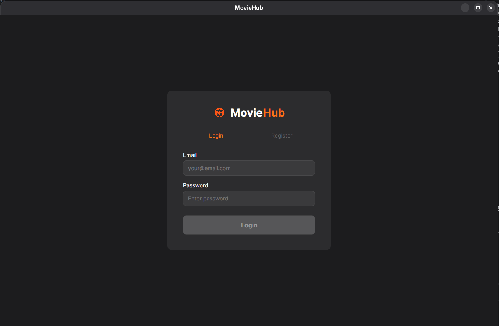
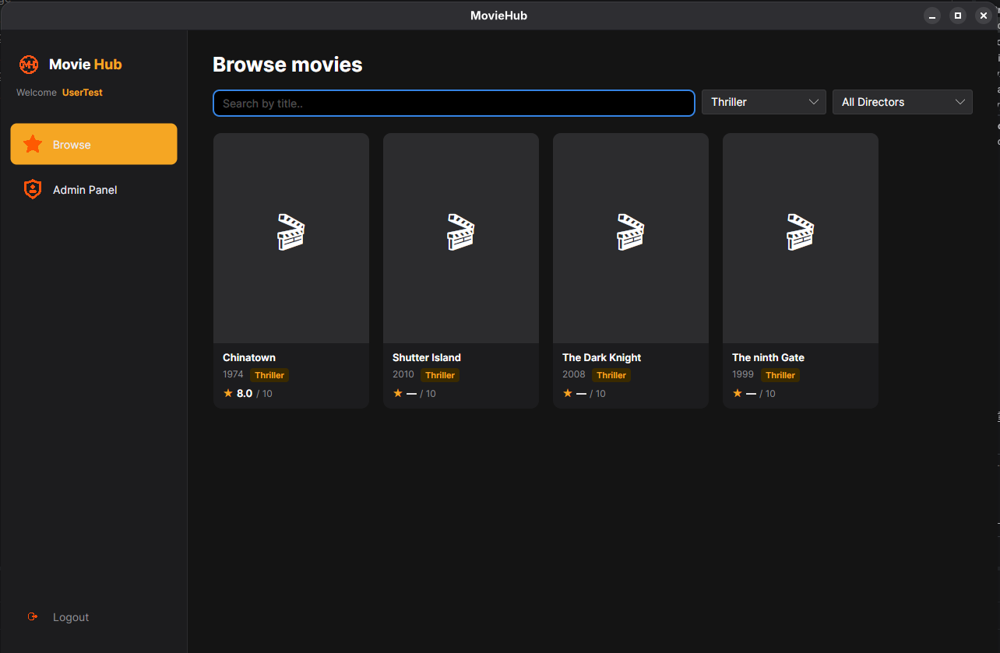
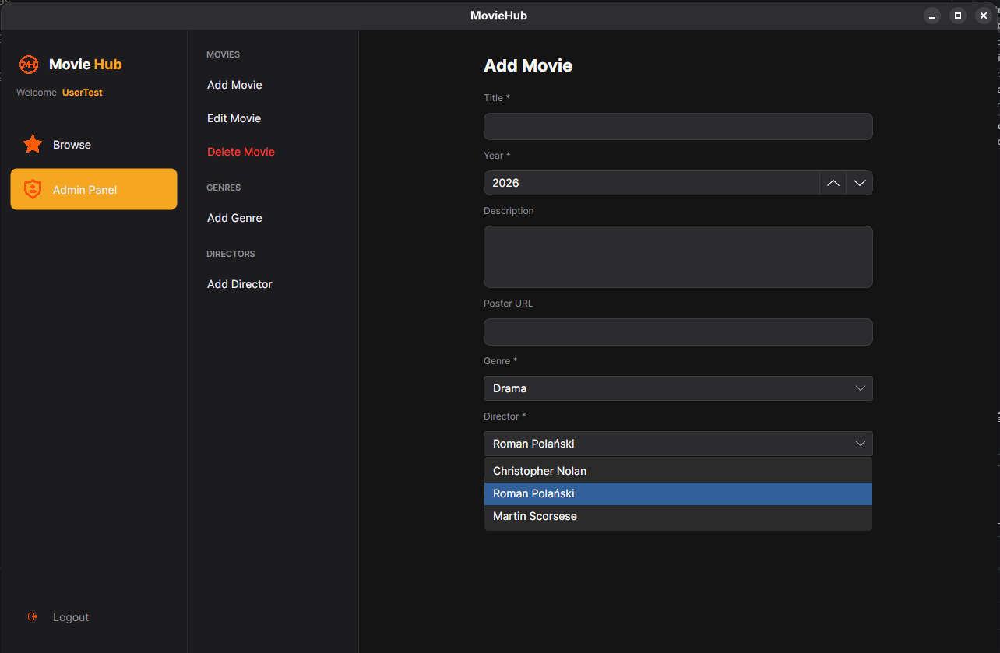

# MovieHub

A full-stack desktop movie rating application — a mini Filmweb/IMDb clone. Users can browse films, read details, and leave ratings. Admins manage the catalog via a dedicated panel.

Built as a university project and portfolio piece, demonstrating a complete end-to-end system with a modern tech stack.

> **Live API:** [https://moviehub-api.azurewebsites.net/scalar/v1](https://moviehub-api.azurewebsites.net/scalar/v1)

---

## Download

| Platform | Link |
|---|---|
| Windows (.exe) | [MovieHub.Client.exe](https://github.com/Alabasterini/MovieHub/releases/download/v1.0.0/MovieHub.Client.exe) |
| Linux | [MovieHub.Client](https://github.com/Alabasterini/MovieHub/releases/download/v1.0.0/MovieHub.Client) |

---

## Screenshots

**Login screen**



**Browse movies**



**Admin panel**



---

## Features

**For users:**
- Browse movies with search by title and filters by genre/director
- View movie details — poster, year, genre, director, description, average score
- Rate movies (1–10 stars) with an optional comment
- Update your own rating at any time

**For admins:**
- Add, edit, and delete movies
- Manage genres and directors
- Admin panel only visible to users with Admin role

**Auth:**
- Email-based registration and login
- JWT access token stored in-memory for the session
- Passwords hashed with BCrypt

---

## Tech Stack

| Layer | Technology |
|---|---|
| Backend | ASP.NET Core Web API (.NET 10) |
| Frontend | Avalonia UI (C#, XAML, cross-platform) |
| ORM | Entity Framework Core |
| Database | PostgreSQL 16 |
| Auth | JWT (access token) |
| Validation | FluentValidation |
| Frontend pattern | MVVM via CommunityToolkit.Mvvm |
| Deployment | Azure App Service F1 + Azure PostgreSQL Flexible Server |
| CI/CD | GitHub Actions (OIDC, no stored secrets) |

---

## Architecture

### Backend
```
Controller → Service → DbContext → PostgreSQL
```
- Controllers handle HTTP: status codes, auth checks, extracting JWT claims
- Services own all business logic: DTO mapping, password hashing, average score calculation
- EF Core DbContext used directly in Services (no repository pattern)
- DTOs strictly separate from EF entities

### Frontend (MVVM)
```
View (XAML) ↔ ViewModel ↔ ApiClient → REST API
```
- All views are passive — logic lives in ViewModels
- `NavigationService` controls which view is active in the shell's `ContentControl`
- `SessionService` (singleton, in-memory) holds the JWT token, username, role, userId
- `ApiClient` is a typed `HttpClient` — all API calls go through it
- `ViewLocator` maps `*ViewModel` → `*View` by naming convention

---

## Project Structure

```
MovieHub/
├── MovieHub.slnx
├── docker-compose.yml
└── src/
    ├── MovieHub.API/
    │   ├── Controllers/       AuthController, MoviesController, RatingsController, GenresController, DirectorsController
    │   ├── Services/          AuthService, MovieService, RatingService, GenreService, DirectorService
    │   ├── Models/            User, Genre, Director, Movie, Rating, UserRole
    │   ├── DTOs/              Auth/, Movies/, Ratings/, Genres/, Directors/
    │   ├── Exceptions/        ConflictException, NotFoundException, ForbiddenException, …
    │   ├── Data/              AppDbContext.cs
    │   └── Program.cs
    └── MovieHub.Client/
        ├── Views/             MainWindowView, AuthView, BrowseView, MovieDetailView, AdminView
        ├── ViewModels/        (matching ViewModels + Admin/ subfolder)
        ├── Services/          ApiClient.cs, NavigationService.cs, SessionService.cs
        ├── Models/            (DTOs mirroring API responses)
        └── App.axaml          (DI container setup)
```

---

## Database Schema

```
User       { Id, Username (unique), Email (unique), PasswordHash, Role (User=0/Admin=1), RegisteredAt }
Genre      { Id, Name (unique) }
Director   { Id, FirstName, LastName, Nationality }
Movie      { Id, Title, Year, Description, PosterUrl?, GenreId FK, DirectorId FK }
Rating     { Id, Value (1–10), Comment?, CreatedAt, MovieId FK, UserId FK }
           UNIQUE (MovieId, UserId) — one rating per user per movie
```

---

## API Endpoints

| Method | Endpoint | Auth |
|--------|----------|------|
| POST | `/api/auth/register` | Public |
| POST | `/api/auth/login` | Public |
| GET | `/api/movies` | Public |
| GET | `/api/movies/{id}` | Public |
| POST | `/api/movies` | Admin |
| PUT | `/api/movies/{id}` | Admin |
| DELETE | `/api/movies/{id}` | Admin |
| POST | `/api/movies/{id}/ratings` | User |
| PUT | `/api/ratings/{id}` | User |
| GET | `/api/genres` | Public |
| POST | `/api/genres` | Admin |
| GET | `/api/directors` | Public |
| POST | `/api/directors` | Admin |

`GET /api/movies` supports query params: `?title=&genreId=&directorId=`

---

## Running Locally

### Prerequisites
- .NET 10 SDK
- Docker (for PostgreSQL)
- Node.js (optional, for Scalar UI)

### 1. Start the database
```bash
docker compose up -d
```

### 2. Apply migrations
```bash
cd src/MovieHub.API
dotnet ef database update
```

### 3. Run the API
```bash
dotnet run --project src/MovieHub.API
```
API will be available at `http://localhost:5080`
Scalar UI (interactive docs): `http://localhost:5080/scalar/v1`

### 4. Run the desktop client
```bash
dotnet run --project src/MovieHub.Client
```

### Connection string (local)
```
Host=localhost;Port=5432;Database=moviehub;Username=moviehub;Password=moviehub
```

---

## Deployment (Azure)

| Resource | Details |
|---|---|
| App Service | `moviehub-api` — Free F1, Linux, .NET 10 |
| Database | PostgreSQL Flexible Server B1ms, Poland Central |
| Region | Poland Central |
| CI/CD | GitHub Actions, OIDC authentication (no stored secrets) |

**Auto-schedule:** The database automatically stops at 22:00 and starts at 06:00 (PL time) via a GitHub Actions workflow to stay within the free tier.

### Granting Admin role (production)
```sql
UPDATE "Users" SET "Role" = 1 WHERE "Email" = 'user@example.com';
```

---

## Development Notes

- **OS:** Arch Linux, Avalonia renders via Skia (X11/Wayland)
- **IDE:** JetBrains Rider (Educational Pack)
- **dotnet PATH** on Arch: `/usr/share/dotnet/dotnet` added to `~/.bashrc`
- **`dotnet ef`** commands must be run from within `src/MovieHub.API/`
- Roslyn analyzer false positives from `CommunityToolkit.Mvvm` source generators are cosmetic — build is clean

---


## License

MIT
